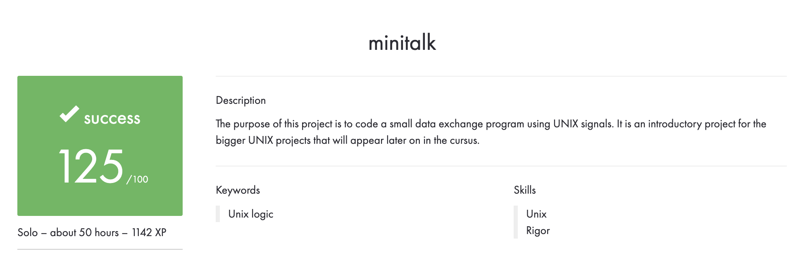

# Português 🇧🇷🇵🇹

<details>
  <summary>
    Saiba mais
  </summary>
  
  # Minitalk
Projeto da [42](https://www.42lisboa.com) - Rank 2 - Minitalk

<details>
  <summary><strong>🏆 Meu desempenho</strong></summary><br />

  
</details>

## 📌 Habilidades

> Habilidades desenvolvidas:

- UNIX signals
- Processos
- Comunicação entre processos
- Manipulação de strings
- Manipulação de memória
- Processos vs Threads

## ‍💻 Softwares necessários

- C compiler (clang)
- GNU make

## ⬇️ Compilando arquivos

```bash
	make #Compila o server e o client.
	make all #Faz exatamente a mesma coisa que apenas 'make'.
	make bonus #Compila os programas do bonus.
	#PS: Todos os comandos listados acima criam a biblioteca, além de compilar as funções.
```

## ⚡ Testando o projeto

```
	Para testar este projeto, é necessário estar em um sistema UNIX, neste caso, o Linux.
	Após executar o comando 'make', o programa 'server' e 'client' serão criados.
	Para executar o programa, basta executar o comando './server' e './client'.
	O programa 'server' deve ser executado primeiro, pois ele é o responsável por receber as mensagens e no início do programa, ele irá mostrar o seu PID.
	Para testar o programa, basta executar o comando './client [SERVER_PID] [MESSAGE]'.
	Exemplo: './client 12345 "Hello World!"'.
	Passe a mensagem que desejar, tenha em mente que quanto maior a mensagem, mais tempo o programa irá demorar para enviar a mensagem, ou seja, para que ela apareça no terminal do 'server'.
```

## Time de desenvolvimento

> Projeto individual:

<table>
    <tr>
      <td>
        
        <h4 align="center">Alê Rabelo</h4>
      </td>
    </tr>
  </table>

## 💬 Contatos

<div align="center" style="display: inline_block">
  <a href="https://www.linkedin.com/in/al%C3%AA-emmanuel-rabelo-guedes/" target="_blank">
    
  </a> 
   <a href="mailto:rabeloguedes@proton.me">
     
  </a>
</div>

</details>

# English 🇺🇸🇬🇧

<details>
  <summary>
    More
  </summary>
  
  # Minitalk
Project from [42](https://www.42lisboa.com/) - Rank 2 - Minitalk

<details>
  <summary><strong>🏆 My accomplishment</strong></summary><br />

  

</details>

## 📌 Skills

> Practiced skills:

- UNIX signals
- Processes
- Inter-process communication
- String manipulation
- Memory manipulation
- Processes vs Threads

## ‍💻 Required Softwares

- C compiler (clang)
- GNU make

## ⬇️ Compiling files

```bash
	make #Compile the server and the client.
	make all #Make exactly the same as just 'make'.
	make bonus #Compile the bonus programs.
	#PS: All the above commands, will create the library, not just compile the functions.
```

## ⚡ Testing the project

```
	To test this project, it is necessary to be on a UNIX system, in this case, Linux.
	After running the 'make' command, the 'server' and 'client' programs will be created.
	To run the program, simply execute the './server' and './client' commands.
	The 'server' program must be executed first, as it is responsible for receiving messages and at the beginning of the program, it will show its PID.
	To test the program, simply execute the './client [SERVER_PID] [MESSAGE]' command.
	Example: './client 12345 "Hello World!"'.
	Pass the message you want, keep in mind that the larger the message, the longer the program will take to send the message, that is, for it to appear on the 'server' terminal.
```

## Squad

> Single person project:

<table>
    <tr>
      <td>
        
        <h4 align="center">Alê Rabelo</h4>
      </td>
    </tr>
  </table>

## 💬 Contact

<div align="center" style="display: inline_block">
  <a href="https://www.linkedin.com/in/al%C3%AA-emmanuel-rabelo-guedes/" target="_blank">
    
  </a> 
   <a href="mailto:rabeloguedes@proton.me">
     
  </a>
</div>

</details>

# Deutsch 🇩🇪

<details>
  <summary>
    Mehr
  </summary>
  
  # Minitalk
Projekt von [42](https://www.42lisboa.com/) - Rank 2 - Minitalk

<details>
  <summary><strong>🏆 Meine Leistung</strong></summary><br />

  
</details>

## 📌 Fähigkeiten

> Ausgeübte Fähigkeiten:

- UNIX-Signale
- Prozesse
- Interprozesskommunikation
- Zeichenfolgenmanipulation
- Speichermanipulation
- Prozesse vs Threads

## ‍💻 Benötigte Software

- C compiler (clang)
- GNU make

## ⬇️ Dateien zusammenstellen

```bash
	make #Kompiliert den Server und den Client.
	make all #Macht genau das gleiche wie nur 'make'.
	make bonus #Kompiliert die Bonusprogramme.
	#PS: Alle oben genannten Befehle erstellen die Bibliothek und kompilieren nicht nur die Funktionen.
```

## ⚡ Projekt Testing

```
	Um dieses Projekt zu testen, ist es notwendig, auf einem UNIX-System zu sein, in diesem Fall Linux.
	Nach dem Ausführen des 'make'-Befehls werden die 'server' und 'client'-Programme erstellt.
	Um das Programm auszuführen, führen Sie einfach die Befehle './server' und './client' aus.
	Das 'server'-Programm muss zuerst ausgeführt werden, da es für den Empfang von Nachrichten verantwortlich ist und am Anfang des Programms seine PID anzeigen wird.
	Um das Programm zu testen, führen Sie einfach den Befehl './client [SERVER_PID] [MESSAGE]' aus.
	Beispiel: './client 12345 "Hello World!"'.
	Geben Sie die gewünschte Nachricht ein, beachten Sie jedoch, dass je größer die Nachricht ist, desto länger das Programm benötigt, um die Nachricht zu senden, d.h. bis sie im Terminal des 'server' erscheint.
```

## Entwickungsteam

> Einzelperson Projekt:

  <table>
    <tr>
      <td>
        
        <h4 align="center">Alê Rabelo</h4>
      </td>
  </table>

## 💬 Kontakt

<div align="center" style="display: inline_block">
  <a href="https://www.linkedin.com/in/al%C3%AA-emmanuel-rabelo-guedes/" target="_blank">
    
  </a> 
   <a href="mailto:rabeloguedes@proton.me">
     
  </a>
</div>

</details>
